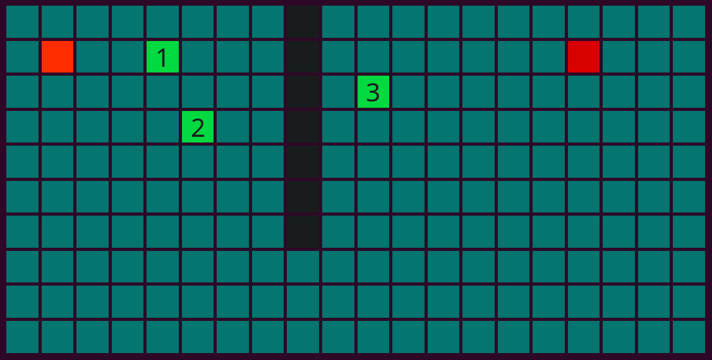

<h1 align="center">Artificial Inteligence</h1>

With this subject I've acquired some knowledge about artificial intelligence and machine learning.
Implemented algorithms:
<ul>
  <li>-A*.</li>
  <li>ID3.</li>
  <li>Clustering:
    <ul><li>Fuzzy K-Means.</li>
    <li>Lloyd's algorithm.</li>
    <li>Parametric Bayes classifier.</li>
    </ul></li>
 </ul>
    
